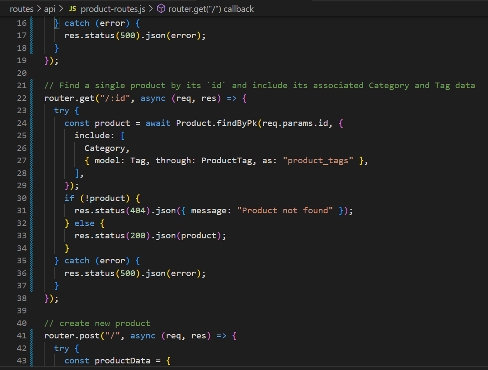

# E-Commerce

## Description

This is the back end for a e-commerce site interacts with MySQL database. It allows a manager at a internet retail company to connect to a database using Sequelize. It displays the categories, products, or tags, and allows them to update, create, and delete from the database. 
## Table of Contents

- [Description](#description)
- [Usage](#usage)
- [Image](#images)

- [Questions](#questions)

## Usage

 [Click here](https://drive.google.com/file/d/1zvZJIbjysdyTklherDR7Bwj6t3wt2rrZ/view?usp=sharing) to see a video of my application working. 
## Image

This is what some of my code looks like 

## Questions

For questions, please contact:

- Email: smilie_kay@yahoo.com
- GitHub: github.com/SmilieKay
